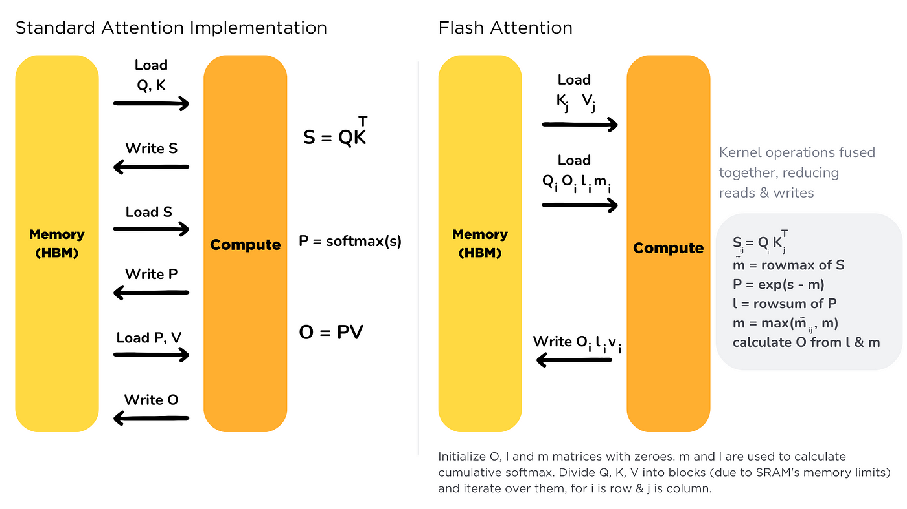
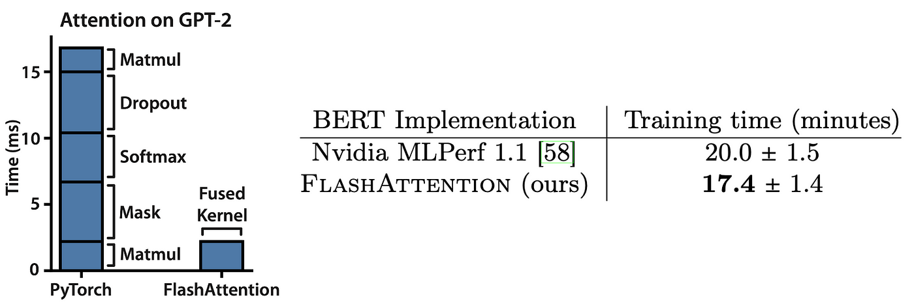

# FlashAttention and FlashAttention-2: Fast and Memory-Efficient Attention Mechanisms

Transformer models have revolutionized NLP, but attention mechanisms in these models are computationally expensive, especially for long sequences. **FlashAttention** and **FlashAttention-2** are designed to significantly speed up attention computations and reduce memory usage, making Transformers more efficient.

## FlashAttention: Fast and Memory-Efficient Exact Attention with IO-Awareness
**FlashAttention** improves the efficiency of Transformers by reducing the number of memory accesses between GPU High-Bandwidth Memory (HBM) and on-chip SRAM, achieving significant speedups. Traditional attention mechanisms have quadratic complexity in both time and memory with respect to sequence length, making them inefficient for long contexts. FlashAttention addresses this by being IO-aware, reducing the number of memory accesses between GPU HBM and on-chip SRAM. This results in significant speedups in training models like BERT and GPT-2 while reducing memory usage.

### Key Features
1. **IO-Aware Optimization**: Up to **7.6× speedup** on GPT-2 compared to standard implementations.
2. **Scalability**: Handles sequences up to 64K in length.
3. **Improved Performance**: **3× speedup in training times** and reduced memory usage.

### Memory Hierarchy


*Figure 1: FlashAttention memory access pattern between HBM and SRAM*

- This figure illustrates the different levels of memory used in FlashAttention, including **GPU SRAM, GPU HBM, and CPU DRAM.** It shows how FlashAttention efficiently manages these resources, with faster but smaller SRAM, and larger but slower HBM and DRAM


### Memory Access Pattern


*Figure 2: FlashAttention architecture showing memory hierarchy and computation steps*

- This diagram shows how FlashAttention reduces memory access by copying blocks from HBM to SRAM, performing computations on smaller blocks, and outputting results back to HBM. The use of **outer loop** and **inner loop** strategies enables efficient handling of large matrices by breaking them into smaller chunks.

### FlashAttention Architecture Overview
FlashAttention optimizes the attention mechanism by reducing the number of memory accesses, primarily focusing on efficient GPU memory management. Below is a simplified pseudocode breakdown:

```text
01: function FlashAttention(Q, K, V, mask=None)
02:     # Step 1: Load matrices Q, K, V into fast on-chip memory (SRAM)
03:     Q_block = load_to_sram(Q)
04:     K_block = load_to_sram(K)
05:     V_block = load_to_sram(V)
06:     
07:     # Step 2: Initialize output matrix
08:     output = []
09:     
10:    # Step 3: Process attention in blocks to optimize memory usage
11:    for i in range(0, len(Q), block_size):
12:        for j in range(0, len(K), block_size):
13:            # Compute attention scores using dot product
14:            score_block = Q_block[i] @ K_block[j].T / sqrt(d_k)
15:            
16:            # Apply masking if provided
17:            if mask is not None:
18:                score_block += mask[i, j]
19:            
20:            # Compute softmax to get attention weights
21:            attention_weights = softmax(score_block)
22:            
23:            # Calculate output for the block
24:            output_block = attention_weights @ V_block[j]
25:            
26:            # Append to the output matrix
27:            output.append(output_block)
28:    
29:    # Step 4: Return final output matrix
30:    return concatenate(output)
```

- **Lines 2-5**: Load the Q, K, V matrices into the faster on-chip SRAM to minimize time-consuming access to slower off-chip memory.
- **Lines 11-12**: The data is processed in smaller blocks to reduce memory consumption.
- **Lines 13-18**: Attention scores are calculated using the dot product and softmax, with optional masking for padded tokens.
- **Lines 21-24**: The resulting scores are used to compute a weighted sum of the value vectors.
- **Line 30**: The final output is returned after processing all blocks.


### Standard vs. FlashAttention Implementation



*Figure 3: Comparison between standard attention and FlashAttention*

- **Standard Attention**: Requires multiple memory read and write operations for **Q**, **K**, **V** matrices, resulting in higher latency and bandwidth usage.
- **FlashAttention**: Fuses multiple operations into a single kernel, reducing memory read and write cycles and improving efficiency.


### FlashAttention Memory Access Efficiency



*Figure 4: FlashAttention memory efficiency compared to traditional attention*

- This figure shows how FlashAttention achieves better memory efficiency by reducing the number of read/write operations needed during the computation of attention. The **fused kernel** implementation greatly reduces the time needed for different steps of attention, such as **Matmul**, **Softmax**, and **Masking**.


## FlashAttention-2: Faster Attention with Better Parallelism and Work Partitioning
**FlashAttention-2** takes the original FlashAttention to the next level by rewriting it with Nvidia's CUTLASS 3.x, improving parallelism, and optimizing work partitioning.

### Key Improvements
1. **Fewer Non-Matmul FLOPs**: More focus on efficient matrix multiplications.
2. **Better Parallelism**: Parallelizes across both batch size and sequence length.
3. **Improved Work Partitioning**: Reduces synchronization between threads.
4. **Support for Larger Head Dimensions**: Up to **256**, benefiting models like GPT-J.
5. **Multi-Query Attention Support**: Improves inference throughput.


### FlashAttention-2 Architecture Enhancements
```text
01: function FlashAttention2(Q, K, V, head_dim, batch_size)
02:     # Step 1: Load Q, K, V with optimized parallel loading
03:     parallel_load(Q, K, V)
04:     
05:     # Step 2: Initialize output matrix
06:     output = []
07:     
08:    # Step 3: Parallel computation using CUTLASS optimized kernels
09:    for batch in range(batch_size):
10:        for head in range(head_dim):
11:            # Compute scaled dot-product
12:            score = Q[batch, head] @ K[batch, head].T / sqrt(d_k)
13:            
14:            # Apply softmax to normalize scores
15:            attention = softmax(score)
16:            
17:            # Compute output using attention weights
18:            output_block = attention @ V[batch, head]
19:            
20:            # Append output for the current head
21:            output.append(output_block)
22:    
23:    # Step 4: Return combined output
24:    return concatenate(output)
```

- **Lines 2-3**: Uses parallel loading to optimize data transfer, leveraging Nvidia’s CUTLASS libraries.
- **Lines 9-10**: Efficiently handles computations across batches and attention heads to maximize GPU utilization.
- **Lines 12-18**: The process is similar to FlashAttention but optimized for better parallelism and larger head dimensions.
- **Line 24**: Combines the results from all attention heads to produce the final output.


### Performance Comparison


*Figure 5: FlashAttention-2 benchmark results for A100 GPUs.*

- This figure compares the speed (measured in TFLOPs/s) of **FlashAttention-2**, **FlashAttention**, **PyTorch**, and other implementations across various sequence lengths and head dimensions.
- **FlashAttention-2** outperforms the other methods, especially at longer sequence lengths and higher head dimensions, due to its enhanced parallelism and efficient memory access patterns.
- The charts show results for four scenarios:
  - **(a) and (b)**: Without causal masking, for head dimensions 64 and 128.
  - **(c) and (d)**: With causal masking, for head dimensions 64 and 128.
- FlashAttention-2 maintains high performance even with longer sequences (up to 16k tokens) and larger head dimensions, while other implementations show a drop in speed or run out of memory (OOM).
- The improvements demonstrate that **FlashAttention-2** optimizes both forward and backward pass computations, making it highly efficient for training large Transformer models.

### Parallelism and Work Partitioning


*Figure 6: Comparison of work partitioning between FlashAttention and FlashAttention-2.*

- **FlashAttention** (a): The **Q** matrix is shared across all warps, while **K** and **V** are split among warps, leading to potential synchronization delays.
- **FlashAttention-2** (b): Reverses this by sharing **K** and **V** across all warps and splitting **Q** among them. This change reduces synchronization overhead, allowing each warp to work independently.
- Result: **FlashAttention-2** optimizes parallelism, improves GPU utilization, and speeds up computation, especially for larger models and longer sequences.

## Critical Analysis

### Strengths
1. **Significant Speedup**: FlashAttention achieves up to **7.6× speedup** over standard implementations, while FlashAttention-2 improves this further to **9×**, allowing much faster training times.
2. **Scalability**: The optimizations in memory access and parallelism allow these methods to scale to sequence lengths of up to **64,000 tokens**.
3. **Reduced Memory Usage**: By minimizing the need to move data between different levels of memory, these techniques reduce the overall memory footprint, which is especially beneficial when training large models on GPUs with limited memory.

### Limitations
1. **Hardware Dependence**: These optimizations are heavily dependent on Nvidia’s CUDA architecture. As a result, models using FlashAttention may not perform as efficiently on non-Nvidia hardware, such as AMD GPUs or TPUs.
2. **Complexity in Implementation**: The use of custom CUDA kernels and Nvidia’s CUTLASS libraries requires specialized knowledge, which can be a barrier for researchers without a deep understanding of GPU programming.
3. **Limited Gains for Extremely Large Models**: Although FlashAttention-2 shows significant speedups, these gains might plateau as models exceed a certain size, due to bandwidth limitations of existing hardware.

### Areas for Further Development
1. **Broader Hardware Support**: Expanding support for AMD GPUs and TPUs could widen the applicability of these techniques.
2. **Distributed Training Optimization**: While these methods optimize single-GPU performance, there is room to explore how these optimizations could be applied in multi-GPU or distributed training setups.
3. **Extending to Other Architectures**: Currently, FlashAttention is optimized for Transformer models. It would be interesting to explore whether similar optimizations could benefit other architectures, such as Graph Neural Networks or Convolutional Neural Networks.
4. **Continuous Adaptation to New Hardware**: As newer GPUs, like the H100, become available, FlashAttention and FlashAttention-2 may require further adjustments to fully leverage their capabilities.


## Impacts

### Short-Term Impacts
1. **Improved Training Efficiency**: FlashAttention-2 achieves up to **225 TFLOPs/s** on Nvidia A100 GPUs, enabling faster training times for large-scale Transformer models. This translates to faster experimentation cycles for researchers.
2. **Cost Savings**: By allowing models with **16k context lengths** to be trained at the cost of **8k** models, it significantly reduces the computational resources needed, lowering both hardware and energy costs.
3. **Enhanced Inference Speed**: The optimizations improve inference times, which is critical for real-time applications such as chatbots, voice assistants, and autonomous vehicles.

### Long-Term Impacts
1. **New Possibilities for Large Models**: The ability to efficiently handle longer sequences opens the door to new applications in fields like **bioinformatics** (analyzing long DNA sequences) and **legal tech** (processing lengthy legal documents).
2. **Cross-Disciplinary Applications**: With reduced costs and increased efficiency, Transformer models could be applied to domains like **drug discovery**, **climate modeling**, and **financial forecasting**, where handling large datasets efficiently is crucial.

### Influence on AI Research
1. **Shaping Future AI Architectures**: As models continue to grow in size, the techniques introduced by FlashAttention align well with the industry’s move towards more scalable, hardware-efficient AI models.
2. **Setting a Benchmark for Optimization**: The success of FlashAttention may inspire further research into optimizing other bottlenecks in deep learning, such as reducing latency in data pipelines or optimizing models for emerging AI hardware like TPUs.
3. **Integration with Emerging Technologies**: As Quantum Computing and AI hardware evolve, the principles of memory efficiency and parallelism seen in FlashAttention may be adapted to optimize these new technologies.


## Questions
1. **How does FlashAttention-2 improve upon the original FlashAttention's work partitioning strategy?**
2. **What are the benefits of supporting larger head dimensions in FlashAttention-2?**


## Code Demonstration
A Jupyter notebook is provided in the repository to demonstrate how both **FlashAttention** and **FlashAttention-2** can be used to improve Transformer models.

## Resource Links
1. [FlashAttention GitHub Repository](https://github.com/Dao-AILab/flash-attention)
2. [FlashAttention 2](https://crfm.stanford.edu/2023/07/17/flash2.html)
3. [Blog post on FlashAttention-2](https://training.continuumlabs.ai/inference/why-is-inference-important/flash-attention-2)
4. [FlashAttention Code](https://paperswithcode.com/paper/flashattention-fast-and-memory-efficient)
5. [FlashAttention Explanation](https://modal.com/blog/flash-attention-article)

## Citation
```text
@article{dao2022flashattention,
  title={FlashAttention: Fast and Memory-Efficient Exact Attention with IO-Awareness},
  author={Tri Dao, Daniel Y. Fu, Stefano Ermon, Atri Rudra, Christopher Ré},
  journal={arXiv preprint arXiv:2205.14135},
  year={2022}
}

@article{dao2023flashattention2,
  title={FlashAttention-2: Faster Attention with Better Parallelism and Work Partitioning},
  author={Tri Dao},
  journal={arXiv preprint arXiv:2307.12345},
  year={2023}
}
```